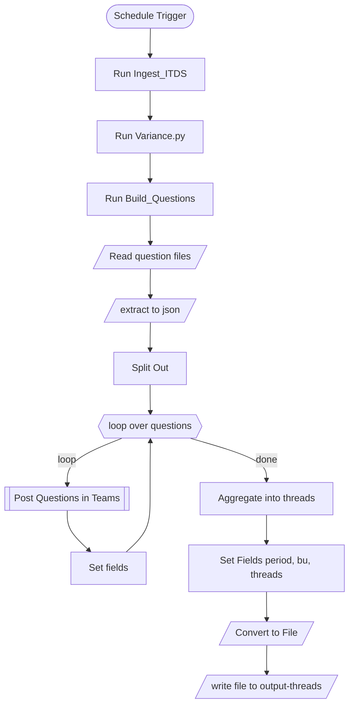
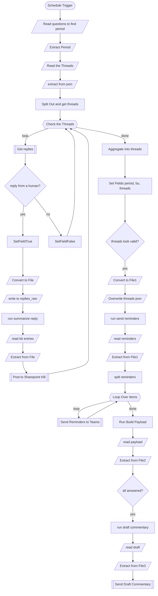

# Aurilo Closing Variance Agent

Automates the monthly variance-explanation loop for Aurilo Group. The
agent reads the ITDS P&L export from Workday Adaptive Planning, works out
which lines moved materially against the prior forecast, asks the
responsible owner about each one in Microsoft Teams, collects and
summarises the answers, and assembles an English commentary draft for
Finance review.

It does not replace review. Every output is a draft, and nothing is
published without a person approving it.

**Installation and the pilot test run: [SETUP.md](SETUP.md).**

## What has to be set by hand

Everything else runs on a schedule. These are the points where a person
decides something:

| What | Where | When it changes |
|---|---|---|
| The monthly Excel export | `data/itds/` | every month — the only recurring manual step |
| Who owns which P&L area | `data/itds/owner_mapping.json` | when responsibilities move |
| Materiality thresholds | `MATERIALITY_THRESHOLD` in `scripts/variance.py` | if Finance revises the rules |
| How many questions per month | `NUM_TOP_MOVERS` in `scripts/variance.py` | if the volume is wrong for the team |
| Lines never to ask about | `NO_FLAG` in `scripts/variance.py` | currently Business Unit Profit, Direct Margin, New Customer Acquisition |
| LLM endpoint and key | `.env` | when Aurilo's own deployment replaces the pilot key |
| Run times | Schedule Trigger in each workflow | if the closing calendar moves |
| Teams channel, SharePoint list | the workflow JSONs | if either is recreated |

## How it works

### 1. Loading the data

- Someone at Aurilo exports the ITDS P&L and drops the Excel file into
  the agent's project folder. The pipeline reads the most recently
  modified `.xlsx`, so older exports can stay where they are.
- **Future:** the agent downloads the right file itself. Needs SharePoint
  access and permission.

### 2. Processing the data

- Parses the statement into the shape the variance stage needs.
- Columns and rows are located by scanning for labels and dates rather
  than fixed positions, which absorbs small format changes. The pipeline
  raises an alert when something does not add up — missing lines, missing
  values — rather than carrying on quietly.
- That approach is what absorbed the June 2026 ERP migration: every line
  name changed, and nothing downstream had to be rewritten.
- **Future:** maintain the parser so it keeps up with month-to-month
  drift without code changes. Another ERP migration would still mean a
  major refactor.

### 3. Calculating and ranking variances

- Each line is compared against the prior forecast, then measured against
  Aurilo's own materiality thresholds. For June 2026 that flagged 62 of
  107 lines.
- Of the flagged lines, only the main statement items are ranked — up to
  ten a month — and turned into questions. June 2026 produced 8.
- Detail accounts are still measured and recorded, but nobody is asked
  about them.
- **Future:** keep flagging and ranking at statement level, then break
  each mover down by dimension — offering, customer group, cost centre —
  so the question points at the driver rather than the total. Also flag
  variances that recur two months or more, even when each month on its
  own stays under the thresholds.

### 4. Mapping lines to their owners

- Statement items are mapped to the owners Marko provided, so each
  question reaches the person who can answer it. Anything unmapped falls
  to the business unit lead.
- **Future:** a mapping at dimension level. Mapping only at statement
  level is too coarse — "Operative Expenses" is one owner, but the
  underlying cost centres are not.

### 5. Asking in Teams

- One question thread per ranked line, posted into the Finance Q&A
  channel. Each states the line, the amount, the percentage, and asks for
  the reason:

  > Hey Erkki Kondelin, Total Revenue came in €929,091 below Prior FC
  > (-10.0%) — what was the reason behind?

- **Future:** @mention the owner rather than only naming them, and ask at
  dimension level so the question carries the finding:

  > Hardware revenue was €1,143,291 below Prior FC (-15.5%), while the
  > rest of the portfolio was slightly up. What drove the hardware
  > shortfall?

### 6. Scanning and collecting replies

- Twice a day, 09:30 and 13:00, the agent checks each open question for a
  reply.
- Unanswered questions get a reminder posted inside their own
  conversation:

  > Reminder — Ari Jaatinen, still waiting for your reply on Operative
  > Expenses.

- Answered ones stop being chased.
- **Future:** check that the person replying is the owner the question
  went to; acknowledge answers rather than staying silent; and ask again
  when an answer is unclear, thin, or off-topic.

### 7. Processing the answers

- The agent reads each reply and condenses it into one factual sentence,
  highlighting the key driver.
- The model also judges whether the reply actually answers the question.
  Off-topic or evasive answers are labelled **needs-review**.
- Every answer is stored in the knowledge base with its question, its
  owner and timestamps, so the reasoning behind each month's numbers is
  logged and auditable.
- **Still needed from Aurilo:** an internal LLM deployment for this step —
  it currently runs on a temporary key belonging to the delivery team.
- **Future:** keep asking until an answer is good enough, instead of
  filing a weak one with a label.

### 8. Drafting the commentary

- Once every question has an answer, the figures and the summarised
  explanations become an English commentary draft.
- Anything flagged **needs-review** is marked in the draft, so the
  reviewer sees which explanations are thin.
- The draft is delivered by email.
- **Still needed from Aurilo:** an internal LLM deployment for the
  drafting step, and permission to post the draft as a link in the Q&A
  channel — the delivery method Aurilo asked for.
- **Future:** no needs-review answers left in the draft, because the
  agent will have chased them down first.

### Scope now, and what comes next

| | Pilot | Next |
|---|---|---|
| Business units | ITDS | MS, Group Functions, One-Time Items |
| Comparison | current forecast vs prior forecast | budget and last year as well |
| Granularity | statement lines only | statement lines broken down by offering, customer group and cost centre |
| Flagging rules | Section 9 thresholds | recurring variance over consecutive months; customer revenue threshold |
| Owner routing | one owner per statement line | per cost centre and per offering |
| Question wording | owner named in the text | real @mention |
| Draft delivery | email | link posted in the Q&A channel |
| Weak answers | flagged for review | chased until answered properly |
| Knowledge base | stored for the record | read back as context for future months |
| Running the workflows | started by hand from n8n | Task Scheduler starts n8n with the machine and the schedules run unattended |

Splitting costs by cost centre and revenue by customer needs dimensions
that are not in the current export; the offering split already is.

## System layout

```
aurilo-ai-agent/
├── data/
│   ├── itds/
│   │   ├── *.xlsx                 monthly P&L export from Adaptive
│   │   └── owner_mapping.json     P&L area → responsible person
│   └── Accounts (6).xlsx          Adaptive account master, for the hierarchy
├── scripts/
│   ├── ingest_ITDS.py             Excel → parsed statement lines
│   ├── variance.py                variances, materiality flags, top movers
│   ├── build_questions.py         questions + owner routing
│   ├── send_reminders.py          one reminder per unanswered line
│   ├── summarize_reply.py         one reply → one knowledge-base entry
│   ├── build_payload.py           whitelisted payload for the LLM
│   ├── draft_commentary.py        payload → commentary draft
│   └── glossary_and_helpers.py    canonical crosswalk, account hierarchy
├── workflows/                     n8n exports — import these, do not edit by hand
├── output/                        everything the pipeline produces
└── start-n8n.cmd                  launcher for Task Scheduler
```

Each script does one step and hands over a JSON file. Business logic
reads only those files and the internal IDs — never Excel or source
labels directly. A future format change costs one adapter, not a rewrite.

### What lands in `output/`

| Folder | Contents |
|---|---|
| `ingest/` | parsed statement lines, each with its source cell |
| `variance/` | variances, materiality flags, ranked top movers |
| `questions/` | questions with their assigned owners |
| `threads/` | what was asked, and which Teams message each question is |
| `replies_raw/` | one file per reply received |
| `kb_entries/` | summarised answers, mirrored to SharePoint |
| `reminders/` | reminders due for unanswered lines |
| `payload/` | the figures and explanations sent to the LLM |
| `draft_commentary/` | the finished draft |

Files are period-stamped and never overwritten, so history accumulates.
That is what a future "this line has missed forecast three months
running" rule will read.

## System architecture

Two n8n workflows. They never call each other — they communicate through
`output/threads/`, which is why one can run monthly and the other several
times a day.

### Workflow 1 — ITDS Monthly Pipeline



Ingest, variance and question building are Python steps. The loop posts
one message per question and records the message ID that Teams returns.
The final file is the record of what was asked — losing it means replies
can no longer be matched back.

### Workflow 2 — Scanning for replies & Send commentary



The inner loop handles one question at a time: fetch its replies, and if
a human answered, summarise and file the answer. The outer path then
rewrites the threads file, sends reminders for whatever is still open,
and produces the draft only when nothing is outstanding.

The reply check ignores the agent's own messages. Reminders are posted as
replies inside each question's thread, so without that filter the agent
would read its own reminders as answers.

## Data privacy

Excel parsing, variance calculation and all intermediate files stay on
the machine. Only aggregated figures and the text of the questions and
answers reach the LLM API, assembled from an explicit allow-list of
fields — source-cell references and anything carrying a counterparty name
never leave.

Teams and SharePoint traffic stays inside Aurilo's own tenant, under the
service account's permissions.

## What to watch, and where the limits are

This is a prototype, running locally on a single machine. Not production
infrastructure: no redundancy, no monitoring beyond the error-handler
email, and scheduled runs happen only while that machine is awake and n8n
is running.

**Publishing a workflow does not keep it running.** `n8n start` is an
ordinary process that stops when its window closes or the machine
reboots. Task Scheduler pointed at `start-n8n.cmd`, triggered at log on
with **Run only when user is logged on**, is what makes it survive — the
alternative runs n8n under a different profile where it finds an empty
database and appears to work with no workflows in it.

**Missed runs are not caught up.** If the machine is off or asleep when a
schedule fires, that run is skipped. The reply-polling workflow recovers
by itself next time, because it re-derives everything from the threads
file. The monthly one does not: miss its slot and no questions go out
that month. Worth setting the machine never to sleep, and worth
considering a monthly trigger that fires more than once on the day.

**The LLM key is temporary and expires on 22 August 2026.** The two
commentary steps run against a DeepSeek key belonging to the delivery
team, provided for this test only. **We will deactivate it on 22 August
2026.** From that date *Run summarize reply* and *Run draft commentary*
will fail; everything else — reading the export, calculating variances,
posting questions, collecting replies, sending reminders — keeps working
as normal.

To restore them, send us the Azure OpenAI endpoint, key, API version and
the two deployment names for a model of your own, and we will supply
updated scripts and instructions. It is a configuration change on our
side, not a rebuild.

**Questions name their owner but do not @mention them.** Mentioning needs
each owner's Azure AD object ID rather than their email address.

**Reminders have no delay rule.** An unanswered question is reminded on
every polling run, twice a day, until it is answered.

**A weak answer still counts as answered.** If a reply does not really
address the question, the agent flags it for review in the draft — but it
stops chasing that line, and the draft is still produced.

**Detail-line attribution depends on the account master.** With
`data/Accounts*.xlsx` present, detail accounts inherit the owner of the
statement line they roll up to. Without it the pipeline runs and
questions still route correctly, but flagged detail lines are no longer
attributed to an owner area.

**The threads file is not reconstructible.** It holds the Teams message
IDs assigned at post time. If it is lost or overwritten with something
malformed, replies to those questions can no longer be collected — the
workflow keeps running and simply finds nothing.
